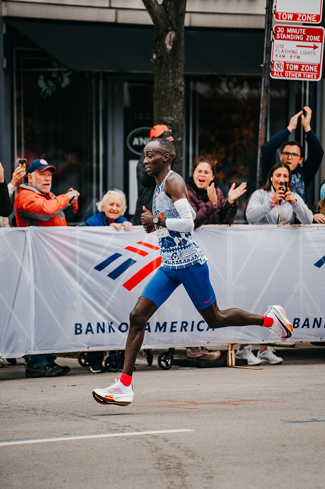

<h1 align="center">Physiological Attributes of Elite Marathon Athletes</h1>

Kelvin Kiptum during his world record run at the 2023 Chicago marathon. Elite marathon runners such as him typically have a V&#775;O2 maximum exceeding 80 ml/kg/minute. For reference, healthy, untrained men typically have a V&#775;O2 maximum in the range of 35-40 ml/kg/minute.
